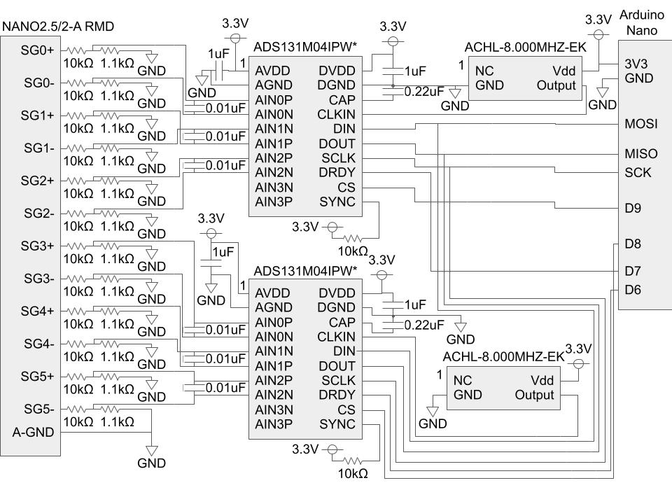

# bl_force_torque_sensor_ros

ROS driver package for [BL force torque sensor](https://www.bl-autotec.co.jp/products/index.php?cid=5).

## Circuit

Before using this package, you have to prepare a circuit connecting your sensor and PC.

### Circuit using Arduino and [ADS131M04](https://www.ti.com/product/ADS131M04) as ADC for sensor with RMD amplifier



## How to install

- Install dependency of `bl_force_torque_sensor_ros` (e.g., by `rosdep install`) and build `bl_force_torque_sensor_ros` (e.g., by `catkin build`)
  - See http://wiki.ros.org/rosdep#Install_dependency_of_all_packages_in_the_workspace for `rosdep` usage

- If you prepare a circuit using Arduino,
  - [Setup Arduino IDE for rosserial](http://wiki.ros.org/rosserial_arduino/Tutorials/Arduino%20IDE%20Setup#Install_ros_lib_into_the_Arduino_Environment). Note that you must do it after sourcing `setup.bash` of the workspace including `bl_force_torque_sensor_ros`. If you did it without sourcing correctly, do it again
  - Upload corresponding firmware to your Arduino. E.g., upload `arduino/sensor_driver_raw_rmd_ads131m04/sensor_driver_raw_rmd_ads131m04.ino` when your circuit uses ADS131M04 for RMD amplifier
    - The firmware may require additional libraries
      - `sensor_driver_raw_rmd_ads131m04.ino`: search and install [CRC](https://www.arduino.cc/reference/en/libraries/crc/) on library manager of Arduino IDE

## How to use

To run sample, you have to specify the calibration matrix of your sensor.
You can pass it via command line, but it may be easier to write and run a simple launch file like:
```xml:my_sample.launch
<launch>
  <include file="$(find bl_force_torque_sensor_ros)/launch/sample.launch">
    <arg name="driver_type" value="rosserial" />  <!-- Specify your driver type (rosserial: you are using Arduino) -->
    <arg name="driver_name" value="bl_force_torque_sensor_driver" />
    <arg name="port" value="/dev/ttyACM0" />  <!-- Specify your circuit's port on your PC -->
    <arg name="baud" value="250000" />  <!-- This depends on the firmware you uploaded -->
    <arg name="sensor_type" value="NANO2.5/2-A" />  <!-- Specify your sensor type -->
    <arg name="amplifier_type" value="RMD" />  <!-- Specify your amplifier type -->
    <arg name="adc_type" value="ADS131M04" />  <!-- Specify your ADC type -->
    <arg name="sensor_frame_id" value="bl_force_torque_sensor" />
    <arg name="rate" value="500" />
    <arg name="calib_matrix" value="[[-0.018373, -0.001612,  0.027921,  0.701325,  0.011503, -0.695529],
                                     [-0.021972, -0.778745,  0.022058,  0.397533,  0.014968,  0.382496],
                                     [ 1.639594, -0.030488,  1.640720, -0.002827,  1.642459,  0.020087],
                                     [-0.002086, -0.384702, -0.889313,  0.196776,  0.952740,  0.192120],
                                     [ 1.110530, -0.049333, -0.542139, -0.325569, -0.481140,  0.351993],
                                     [ 0.033908,  0.335471, -0.000163,  0.262144, -0.008585,  0.347287]]" />
  </include>
</launch>
```
