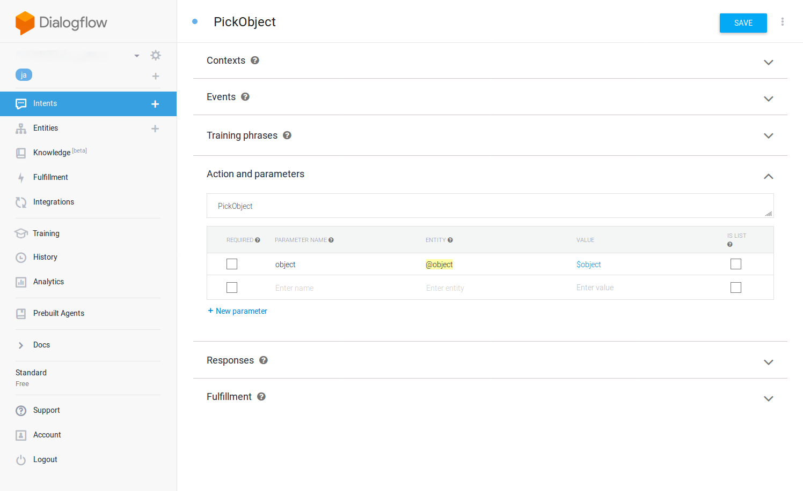

# dialogflow_task_executive

A ROS package for Task execution with Dialogflow

## Installation to your new robot

### Create a Dialogflow account

Go to [Dialogflow](https://dialogflow.com/) website and create an account.

If you are a JSK lab member, ask s-kitagawa or k-okada about JSK dialogflow account.


### Create new Agent on Dialogflow

Go to console on Dialogflow [Dialogflow](https://dialogflow.com/) and create new agent.


### Create new Service account key

Go to [this page](https://cloud.google.com/docs/authentication/getting-started) and create service account key.

The page is as shown below and press blue button to create the key.

You can download the key as JSON file in the age and save the JSON file in your robot.


### Set environmental variables in your robot

We need to set two environment variables: `GOOGLE_APPLICATION_CREDENTIALS` and `DIALOGFLOW_PROJECT_ID`.

- `GOOGLE_APPLICATION_CREDENTIALS`
  - Path to Service account key JSON file (i.e. `/etc/ros/hogehoge.json`)
- `DIALOGFLOW_PROJECT_ID`
  - Dialogflow project ID (i.e. `pr2-hogehoge`)

## How to register new task in Dialogflow

### Create new `app_manager` app

First, you need to create your task program to `app_manager` app.
Your app is registered and controled with tag `<package name>/<app name>` (i.e. `your_package/your_demo`).

Please read [app_manager](https://github.com/PR2/app_manager/) for more detailed information.

## Create new Intent in Dialogflow

For your new task, create new Intent as below.

`Action` section, you must name camel-cased name of your `app_manager` app.

If your app is registered as `your_package/your_demo`, you need to set `YourDemo` in `Action` section.

(i.e. App name: `detect_cans_in_fridge201202/pick_object` -> Dialogflow Action: `PickObject`)



In order to fulfill other forms, please read [dialogflow doc](https://dialogflow.com/docs/intents) for more detailed information abount Intent.


## Usage

### Launch `jsk_robot_startup/lifelog/app_manager.launch`

```bash
roslaunch jsk_robot_startup app_manager.launch
```

**Note**: You should skip this If you are using PR2 and Fetch in JSK lab because this launch is running by default.

### Launch `dialogflow_task_executive/launch/dialogflow_task_executive.launch`

```bash
roslaunch dialogflow_task_executive dialogflow_task_executive.launch
```

**Note**: You can run this launch by `sudo initctl jsk-dialog start` on PR2 and Fetch in JSK lab.

### Ask your robot to do the task

Your robot will execute the task from dialogflow.


## Author

Yuki Furuta <furushcheve@jsk.imi.i.u-tokyo.ac.jp>

Shingo Kitagawa <s-kitagawa@jsk.imi.i.u-tokyo.ac.jp>

## License

BSD
