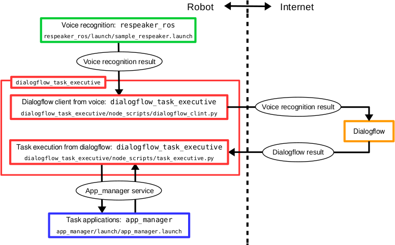

# dialogflow_task_executive

A ROS package for Task execution with Dialogflow


## System structure



## Installation to your new robot

### Create a Dialogflow account

Go to [Dialogflow](https://dialogflow.com/) website and create an account.

If you are a JSK lab member, ask s-kitagawa or k-okada about JSK dialogflow account.


### Create new Agent on Dialogflow

Go to console on Dialogflow [Dialogflow](https://dialogflow.com/) and create new agent.


### Create new Service account key

Go to [this page](https://cloud.google.com/docs/authentication/getting-started) and create service account key.

The page is as shown below and press blue button to create the key.

You can download the key as JSON file in the age and save the JSON file in your robot.


### Set configuration

#### Use environmental variables

We need to set two environment variables: `GOOGLE_APPLICATION_CREDENTIALS` and `DIALOGFLOW_PROJECT_ID`.

- `GOOGLE_APPLICATION_CREDENTIALS`
  - Path to Service account key JSON file (i.e. `/etc/ros/hogehoge.json`)
- `DIALOGFLOW_PROJECT_ID`
  - Dialogflow project ID (i.e. `pr2-hogehoge`)

#### Use launch file arguments

Or we can use `credential` and `project_id` arguments of ` dialogflow_task_executive.launch` file

```
roslaunch dialogflow_task_executive dialogflow_task_executive.launch credential:=/etc/ros/hogehoge.json project_id:=pr2-hogehoge
```

If you have `project_id` in both your credential file and rospram (or argument of `dialogflow_task_executive.launch`), the `project_id` in both your credential file becomes effective. To use `project_id` in rosparam, use `~override_project_id` option.

## How to register new task in Dialogflow

### Create new `app_manager` app

First, you need to create your task program to `app_manager` app.
Your app is registered and controled with tag `<package name>/<app name>` (i.e. `your_package/your_demo`).

Please read [app_manager](https://github.com/PR2/app_manager/) for more detailed information.

## Create new Intent in Dialogflow

For your new task, create new Intent as below.

`Action` section, you can set full name (`<package name>/<app name>`), app name or camel-cased name of your `app_manager` app.
The Full name (`<package name>/<app name>`) is recommended to avoid name confliction.

If your app is registered as `your_package/your_demo`, you need to set `your_package/your_demo`, `your_demo` or  `YourDemo` in `Action` section.

(i.e. App name: `detect_cans_in_fridge201202/pick_object` -> Dialogflow Action: `detect_cans_in_fridge201202/pick_object`, `pick_object` or `PickObject`)


In order to fulfill other forms, please read [dialogflow doc](https://dialogflow.com/docs/intents) for more detailed information abount Intent.


## Usage

### Launch `jsk_robot_startup/lifelog/app_manager.launch`

```bash
roslaunch jsk_robot_startup app_manager.launch
```

**Note**: You should skip this If you are using PR2 and Fetch in JSK lab because this launch is running by default.

### Launch `dialogflow_task_executive/launch/dialogflow_task_executive.launch`

```bash
roslaunch dialogflow_task_executive dialogflow_task_executive.launch
```

**Note**: You can run this launch by `sudo initctl jsk-dialog start` on PR2 and Fetch in JSK lab.

### Ask your robot to do the task

Your robot will execute the task from dialogflow.


## Upstart example

Edit a config file below and save it as `/etc/init/jsk-dialog.conf`

You can control `dialogflow_task_executive` service by `sudo initctl start jsk-dialog`.

See [config/jsk-dialog.conf](./config/jsk-dialog.conf)

```bash
# make sure that robot is running
start on robot-is-up
stop on robot-is-down

respawn
console log

# set your own env parameters
env USERNAME=<user name>
env ROS_ENV_LOADER=<ROS env loader path>
env GOOGLE_APPLICATION_CREDENTIALS=<Google service account key path> 
env DIALOGFLOW_PROJECT_ID=<Dialogflow project ID>

pre-start script
  exec >"/tmp/ros_run_id"
  echo "ROS_IP=$(ip -o route get 8.8.8.8 | awk '{print $7;}')"
end script

script
  exec su $USERNAME -c ". /tmp/ros_run_id; $ROS_ENV_LOADER roslaunch dialogflow_task_executive dialogflow_task_executive.launch run_app_manager:=false --screen --wait"
end script
```

## Sample programs for JSK users

1. Open [Dialogflow](https://dialogflow.cloud.google.com/?authuser=1#/editAgent/eternal-byte-236613/) and setup Intents and Entities.

2. Download google credentials file. You can download from [Google Drive](https://drive.google.com/file/d/1VxniytpH9J12ii9jphtBylydY1_k5nXf/view?usp=sharing) link.


3. Start sample code

```
roslaunch dialogflow_task_executive demo.launch google_cloud_credentials_json:=${HOME}/Downloads/eternal-byte-236613-4bc6962824d1.json
```

## Author

Yuki Furuta <furushchev@jsk.imi.i.u-tokyo.ac.jp>

Shingo Kitagawa <s-kitagawa@jsk.imi.i.u-tokyo.ac.jp>

## License

BSD
