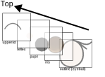

# Eye Display Module

[](https://github.com/sktometometo/eye-display/actions/workflows/main.yml)
[](https://github.com/sktometometo/eye-display/actions/workflows/full.yml)

https://github.com/user-attachments/assets/e2b44bc5-4f85-489f-b862-e851fd4cdf32

Eye Display Module

## Supported devices

1. Round Display Module with M5Stamp C3 (pio env name: `stampc3`) : https://www.switch-science.com/products/8098
2. Round Display Module with M5Stamp S3 (pio env name: `stamps3`) : https://www.switch-science.com/products/8971

## How to use

### Installation

First you have to install ROS and PlatformIO

```bash
pip install platformio
```

And then, you can build and upload the firmware to the device.

It is recommended to put this repo in a catkin workspace.

```bash
mkdir ~/catkin_ws/src
cd ~/catkin_ws
catkin init
cd ~/catkin_ws/src
git clone https://github.com/sktometometo/eye-display.git
rosdep install --from-paths . --ignore-src -y -r
catkin build eye_display
source ~/catkin_ws/devel/setup.bash
```

### Simple demo


https://github.com/user-attachments/assets/e2b44bc5-4f85-489f-b862-e851fd4cdf32


You can check basic functionalities with a demo firmware.

```bash
roscd eye_display
pio run -e stampc3-ros
pio run -e stampc3-ros -t uploadfs --upload-port <port to device>
pio run -e stampc3-ros -t upload --upload-port <port to device>
```

Please replace `stampc3` with `stamps3` if you use type 2 device.

After building and uploading the firmware, you can control the device through ROS topic

```bash
roslaunch eye_display demo.launch port:=<port to device> mode_right:=<true or false>
```

Then you can control the device with the demo scripts.

```bash
rosrun eye_display pub_eye_status.py
```

```bash
rosrun eye_display demo_move_eye.py
```


You can also directly control pupil position by publish a message to "/eye_display/look_at" topic.

```bash
rostopic pub -1 /eye_display/look_at geometry_msgs/Point "{x: 40.0, y: -10.0, z: 0.0}"

```

You can control emotion expression with eye by publishing a message to "/eye_display/eye_status" topic.

```bash
rostopic pub -1 /eye_display/eye_status std_msgs/String "data: 'happy'"
```

To get the list of  emotional expression of the eyes, you can use following command.

```bash
$rosparam get eye_display/eye_asset/names
[normal, blink, surprised, sleepy, angry, sad, happy]
```

#### I2C version

If you want to control the device through I2C bus, please use following env.

- `stampc3-i2c-right`: Stamp C3 device on right eye
- `stampc3-i2c-left`: Stamp C3 device on left eye
- `stamps3-i2c-right`: Stamp C3 device on right eye
- `stamps3-i2c-left`: Stamp C3 device on left eye

```bash
roscd eye_display
pio run -e stampc3-i2c-right
pio run -e stampc3-i2c-right -t uploadfs --upload-port <port to device>
pio run -e stampc3-i2c-right -t upload --upload-port <port to device>
```

Then you can control the device with I2C.

### Description of direction


### How to update image



## For Developers

### How to update msg

Message headers in [`lib/ros_lib`](./lib/ros_lib/) directory are automatically generated with `make_libraries.py` script in `rosserial_arduino` package.

And this repo provide easy way to update `ros_lib` as [update_ros_lib.sh](./scripts/update_ros_lib.sh).

So if you want to update message definition in [`msg`](./msg/) directory, please run the following command.

```bash
catkin build eye_display
source <path/to/catkin_ws>/devel/setup.bash
rosrun eye_display update_ros_lib.sh
```

### How to clone only this package

This feature requires git 2.27+, so if you use Ubuntu<=20.04, please install latest version of git https://git-scm.com/downloads/linux

```
$ git clone --filter=blob:none --sparse https://github.com/jsk-ros-pkg/jsk_3rdparty.git -b eye_display
$ git sparse-checkout set eye_display
```
