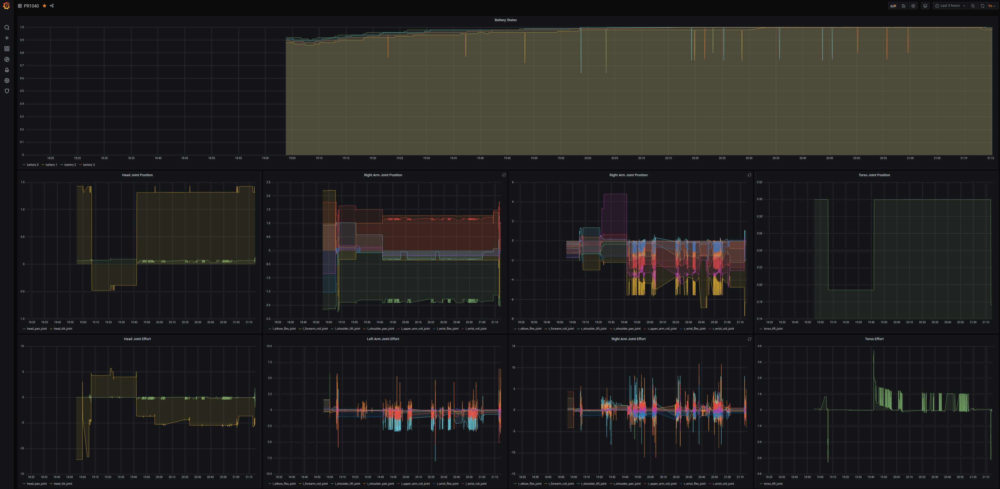

# influxdb_store

ROS package for influxdb store



## Sample

```bash
roslaunch influxdb_store influxdb_logger.launch
```

## Logger

### `joint_states_logger.py`

Logger for `sensor_msgs/JointStates`

#### Subscribing topic

- `~input` (`sensor_msgs/JointStates`)

Joint states topic name

#### Parameters

- `~host` (default: `localhost`)

Influxdb host address

- `~port` (default: `8086`)

Influxdb port number

- `~database` (default: `test`)

Influxdb database name

### `map_transform_logger.py`

Logger for transfrom relative to `map_frame`

#### Parameters

- `~host` (default: `localhost`)

Influxdb host address

- `~port` (default: `8086`)

Influxdb port number

- `~database` (default: `test`)

Influxdb database name

- `~map_frame_id` (default: `map`)

Map frame id

- `~update_rate` (default: `0.5`)

Update rate

### `battery_states_logger.py`

Logger for `pr2_msgs/BatteryServer2`

#### Subscribing topic

- `~input` (`pr2_msgs/BatteryServer2`)

Battery topic name

#### Parameters

- `~host` (default: `localhost`)

Influxdb host address

- `~port` (default: `8086`)

Influxdb port number

- `~database` (default: `test`)

Influxdb database name

### `network_states_logger.py`

Logger for network information published by [`jsk_network_tools/network_status.py`](https://github.com/jsk-ros-pkg/jsk_common/tree/master/jsk_network_tools)

#### Subscribing topic

- `~input/receive` (`std_msgs/Float32`)

receiving bps topic name

- `~input/transmit` (`std_msgs/Float32`)

Transmitting bps topic name

#### Parameters

- `~host` (default: `localhost`)

Influxdb host address

- `~port` (default: `8086`)

Influxdb port number

- `~database` (default: `test`)

Influxdb database name

## For JSK PR2 users

### PR1012

```bash
rossetip
rossetmaster pr1012
roslaunch influxdb_store pr2_influxdb_logger.launch robot_name:=pr1012
```

### PR1040

```bash
rossetip
rossetmaster pr1040
roslaunch influxdb_store pr2_influxdb_logger.launch robot_name:=pr1040
```

### Fetch15

```bash
rossetip
rossetmaster fetch15
roslaunch influxdb_store fetch_influxdb_logger.launch robot_name:=fetch15
```

### Fetch1075

```bash
rossetip
rossetmaster fetch1075
roslaunch influxdb_store fetch_influxdb_logger.launch robot_name:=fetch1075
```

### Baxter

```bash
rossetip
rossetmaster baxter
roslaunch influxdb_store baxter_influxdb_logger.launch robot_name:=baxter
```

### Systemctl services

Please see [jsk_database](https://github.com/knorth55/jsk_database).
